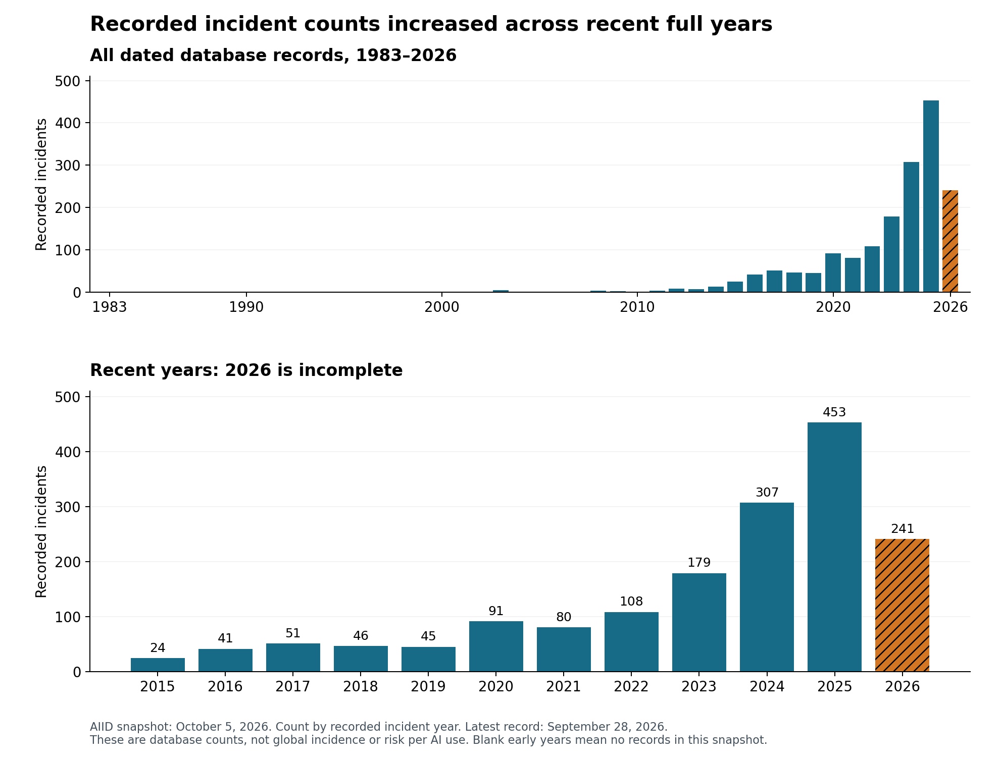
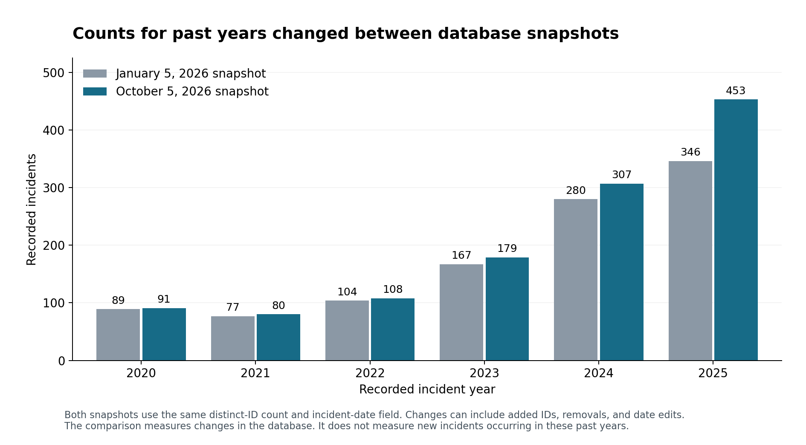
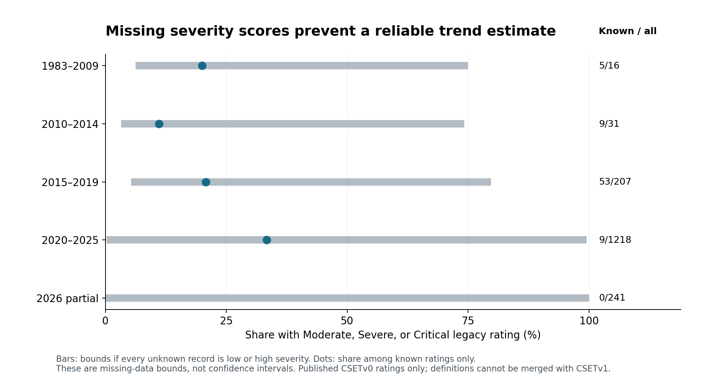

# AI incident counts and severity: historical trends and data limits

**Date:** October 8, 2026  
**Version:** 1.0  
**Type:** Analysis of public data  
**Review status:** AI-generated research note. Agent checks are documented in [review.md](review.md). No human review or external peer review is claimed.

## Abstract

Recorded AI incident counts have increased strongly across recent full years. The available severity data does not establish whether the average incident has become more severe. We analysed 1,713 distinct records from the October 5, 2026 AI Incident Database snapshot. Recorded dates span 1983–2026. Counts rose from 91 in 2020 to 453 in 2025. The 2025 count was 47.6% above 2024. However, only 76 records, or 4.4%, have a published, known CSETv0 severity score. Those scores stop in 2020. A comparison with the January 5, 2026 snapshot found 159 added records dated before 2026. This demonstrates a material delay in database coverage. The study provides new calculations for these snapshots, a record-level change check, and bounds for missing severity data. It does not measure all global AI incidents, harm per AI use, or a complete history from 1956.

## 1. Question and scope

The question is: **How have AI incident quantity and severity changed since AI began?**

Dartmouth identifies its 1956 summer research project as the start of AI as a field. [1] This dataset cannot support a complete series from that date. The AI Incident Database launched in 2020. It includes earlier events added after their recorded dates. [2]

The earliest dated record in the selected snapshot is the 1983 nuclear false alarm, record 27. Its CSET classification says that the system was not AI. [3] Thus, 1983 is the earliest database date, not a confirmed first AI incident. Missing early records do not establish an absence of harm.

We count all distinct AIID incident IDs. This preserves the source database scope. We do not claim that every record satisfies one strict AI or harm definition. Of the 208 published CSETv1 annotations, 28 say that the system is not AI. These annotations do not cover the whole database.

## 2. Related work and contribution

Historical incident counts are already published in the Stanford AI Index. Its 2026 summary gives 233 incidents for 2024 and 362 for 2025. [4] Those values differ from this study's later fixed snapshot. They must not be combined into one series without a version check.

Mylius already used an LLM to classify harm severity across ten categories. The source calls the results illustrative and warns that scores across harm categories are not equivalent. [5] Abraham et al. and Mengesha et al. explain why incident counts need reporting and exposure data before they can measure risk. These are 2026 preprints. [6, 7]

This note does not claim a first historical trend analysis or a new statistical method. Its contribution is a repeatable analysis of two specified snapshots. It shows how historical counts changed between those snapshots. It also measures how little of the current database has a published, known legacy severity score.

The search record and limits are in [source_search.md](source_search.md).

## 3. Data and method

### Fixed inputs

We used the official October 5, 2026 and January 5, 2026 AIID archives. [8] The October archive has 1,713 incident rows. The January archive has 1,313. Source URLs, file hashes, and extract details are in [source_manifest.json](source_manifest.json).

The unit is one distinct incident ID. A media article is not a separate incident in this analysis. Each record has the same weight, regardless of the number of articles or people affected.

We group by the main incident `date` field. We do not replace it with CSET dates. All source dates used here parse as calendar dates. No time zone conversion is applied. There are no duplicate IDs or missing dates in these incident extracts. Each published classification ID matches an incident ID.

Full-year comparisons end in 2025. The latest recorded date in the October snapshot is September 28, 2026. We show 2026 separately. We also compare January 1 to September 28 in each of 2025 and 2026. Equal calendar windows do not give each year equal time for reports to enter the database.

### Severity and missing data

We use CSETv0 `Severity` values only where `Published=True`. The ordered labels are Negligible, Minor, Moderate, Severe, and Critical. We do not assume equal numerical distances between them. We exclude eight unpublished rows. We treat the 16 published Unclear/unknown scores as unknown.

The v0 definitions include harm that occurred and harm that nearly occurred. A high score does not prove that the harm occurred. [10]

CSETv1 has different fields. Its `AI Harm Level` describes harm events, near misses, issues, or unclear cases. It is not the CSETv0 severity scale. We do not merge the two scales. CSET states that its annotation work stopped after June 2024. [9]

For a sensitivity check, we combine Moderate, Severe, and Critical as an indicator. This is an analysis threshold, not a legal category. For each period, let N be all records, K known published severity scores, and H scores at or above Moderate. The observed share among known scores is H/K. It does not estimate the unclassified records.

If every unknown score were below the threshold, the all-record share would be H/N. If every unknown score were above it, the share would be (H + N - K)/N. These are bounds for missing data. They are not confidence intervals. They assume that the old scale could be applied to every record without error. This strong assumption makes the check illustrative.

### Snapshot changes

We compare IDs and dates between January and October. For each incident year, the count change equals added IDs minus removed IDs, plus records moved into the year by date edits, minus records moved out. The script checks this identity for every year.

The [analysis plan](analysis_plan.md) was saved before calculation. The snapshot comparison was added after schema inspection and before analysis of the January snapshot. We report it as an exploratory sensitivity check.

## 4. Results

### 4.1 Recorded quantity increased in recent full years

| Recorded period | Incident records |
| --- | ---: |
| 1983–2009 | 16 |
| 2010–2014 | 31 |
| 2015–2019 | 207 |
| 2020 | 91 |
| 2021 | 80 |
| 2022 | 108 |
| 2023 | 179 |
| 2024 | 307 |
| 2025 | 453 |
| 2026, through the latest recorded date of September 28 | 241 |
| **Total** | **1,713** |

The first three rows span different numbers of years. They show historical coverage and are not comparable annual rates. The full annual table is in [results_annual.csv](results_annual.csv).

The 2025 count is 4.98 times the 2020 count. It is 47.6% above 2024. The count did not increase every year: 2021 has fewer records than 2020. These findings describe records in one database version.

*Figure 1. All dated records and a recent-year view. The hatched 2026 bar is incomplete. Zero-height early bars mean no records in this snapshot, not proof of no events.*

For the matched January 1–September 28 window, 2025 has 333 records and 2026 has 241. The recorded count is 27.6% lower in 2026. This is **not evidence that underlying AI harm fell**. The 2026 records have had less time to be reported and entered. No estimate of reporting completeness is available.

### 4.2 Counts for past years changed after the year ended

| Incident year | January snapshot | October snapshot | Net addition |
| --- | ---: | ---: | ---: |
| 2023 | 167 | 179 | 12 |
| 2024 | 280 | 307 | 27 |
| 2025 | 346 | 453 | 107 |

The snapshots contain 400 added IDs and no removed IDs. Of the added IDs, 159, or 39.8%, are dated before 2026. Four existing IDs have date edits. Only one edit changes the incident year: ID 76 moves from 2020 to 2019.

For 2025, the count increased by 107, or 30.9%, between the snapshots. All 107 are added IDs. They are not events that occurred in 2026. This is direct evidence that recent annual counts can change substantially after the year ends. It does not identify whether each delay came from late public reporting, database entry, or another editorial process.

*Figure 2. The same incident-year counting method applied to both snapshots. Full details are in [results_snapshot_change.csv](results_snapshot_change.csv).*

### 4.3 The severity direction cannot be established

The legacy severity file has 92 published rows. Of these, 76 have a known score. That is **4.4% of the 1,713 records**. Their latest incident date is December 18, 2020.

| Published CSETv0 score | Records |
| --- | ---: |
| Negligible | 43 |
| Minor | 17 |
| Moderate | 11 |
| Severe | 5 |
| Critical | 0 |
| Unclear/unknown | 16 |

The raw file contains one Critical label in an unpublished row. It is excluded. A missing label is never treated as Negligible.

| Recorded period | Known scores / all records | Known-score coverage | Bounds for the share at or above Moderate |
| --- | ---: | ---: | ---: |
| 1983–2009 | 5 / 16 | 31.3% | 6.3%–75.0% |
| 2010–2014 | 9 / 31 | 29.0% | 3.2%–74.2% |
| 2015–2019 | 53 / 207 | 25.6% | 5.3%–79.7% |
| 2020–2025 | 9 / 1,218 | 0.7% | 0.2%–99.5% |
| 2026 partial | 0 / 241 | 0.0% | 0.0%–100.0% |

All nine known scores in the 2020–2025 band come from 2020. The bars overlap widely. They permit both increases and decreases. Thus, this source does not identify a severity trend.

*Figure 3. Bounds include unclassified and unknown records. Dots show the selected, known-score subset only. These dots must not be read as population severity estimates.*

CSETv1 has 208 published rows, or 12.1% coverage. Its latest recorded incident date is December 20, 2023. None of the 1,001 records dated 2024–2026 has a CSETv0 or CSETv1 annotation in these files. Their lack of labels does not imply low severity.

## 5. Interpretation and safety relevance

The supported historical pattern is a large rise in **recorded quantity**, with sparse earlier coverage. The data does not establish a corresponding rise or fall in **severity per incident**.

Several processes can increase the count: more AI use, a higher event rate, more reporting, wider database collection, or changes in definitions. This study cannot separate them. It also cannot attribute the rise to generative AI, regulation, or any single cause.

For safety monitoring, the practical result is a need to publish three items together: incident counts, classification coverage, and the database snapshot date. A severity average without coverage can create false confidence. A year comparison without a version date can conceal later additions.

A stronger study would use a defined sector, a stable reporting rule, a common severity scale, and an exposure measure. Exposure could be vehicle distance or the number of relevant decisions. A sample of recent incidents would also need independent human classification. These are proposed next steps, not completed work.

## 6. Limitations

This is a selected public-report registry, not a census or random sample. Missing events and media selection can affect every year. Early records were collected retrospectively. The dataset does not cover the whole period since 1956.

Incident records can represent different event scopes, including series of events. One record is not one injured person. Recorded dates can be uncertain or refer to different points in an extended event. A separate schema audit found differences between main incident years and some CSET year fields. We use the main date consistently.

Published classifications are not complete coverage or proof of ground truth. Their selection process can favour particular event types. We did not reclassify all 1,713 incidents or validate every original media account. CSETv1 death and injury fields were not summed. Their notes can include uncertain AI links, grouped events, estimates, and zeros in incomplete records.

The severity bounds do not correct label errors or incompatible harm concepts. They only show the effect of missing values under a stated common-scale assumption. The newer automated severity work was reviewed as prior work, but its scores were not merged with this dataset.

No statistical significance test is used. Exact database counts have no sampling error within the frozen extracts. This does not remove the larger uncertainty from reporting, classification, date choice, and dataset selection.

## 7. Ethics, AI use, and review

Only public records and necessary factual fields are included. The extracts omit article text, descriptions, and personal names. Data attribution and source license terms appear in [DATA_LICENSE.md](DATA_LICENSE.md). This analysis makes no allegation about any named individual or organization.

Codex selected sources, wrote code, generated figures, and drafted this report. Separate Codex agents checked source limits, severity fields, and calculations. Agent review is not independent human review. The user requested and authorized publication but has not been represented as the author or reviewer of the analysis.

No paid model experiment was run. No new severity scores were generated. The study used local computation and public data. It is not peer reviewed, certified, or endorsed by the source organizations.

## 8. Reproduction

The [README](README.md) gives the commands. The included extracts reproduce the tables and figures. The download script also retrieves both original archives and verifies their hashes. [run_log.txt](run_log.txt) records the completed analysis output. [review.md](review.md) records the checks and their limits.

## References

1. Dartmouth. *Artificial Intelligence (AI) Coined at Dartmouth*. [Historical account](https://home.dartmouth.edu/about/artificial-intelligence-ai-coined-dartmouth). Accessed October 8, 2026.
2. Partnership on AI. *AI Incident Database*, November 18, 2020. [Launch announcement](https://partnershiponai.org/aiincidentdatabase/).
3. AI Incident Database. *Incident 27: Nuclear False Alarm*. [Incident record](https://incidentdatabase.ai/cite/27/). Accessed October 8, 2026.
4. Stanford HAI. *The 2026 AI Index Report: Responsible AI*. [Chapter summary](https://hai.stanford.edu/ai-index/2026-ai-index-report/responsible-ai). Accessed October 8, 2026.
5. Mylius, S. (2025). *Scalable AI Incident Classification*. [AIID blog](https://incidentdatabase.ai/blog/scalable-ai-incident-classification/).
6. Abraham, S., et al. (2026). *AI Incident Monitoring through a Public Health Lens*. arXiv:2604.19914v1. [Preprint](https://arxiv.org/abs/2604.19914v1).
7. Mengesha, I., et al. (2026). *A Pragmatic Classification Framework for AI Incident Monitoring*. arXiv:2604.21412v3. [Preprint](https://arxiv.org/abs/2604.21412v3).
8. Responsible AI Collaborative and contributors. *AI Incident Database snapshots*, January 5 and October 5, 2026. [Archive index](https://incidentdatabase.ai/research/snapshots/). Database method: McGregor, S. (2021), *Preventing Repeated Real World AI Failures by Cataloging Incidents: The AI Incident Database*. [Paper](https://arxiv.org/abs/2011.08512).
9. Center for Security and Emerging Technology. *CSET's Harm Taxonomy for the AI Incident Database*. [Documentation](https://github.com/georgetown-cset/CSET-AIID-harm-taxonomy) and [AIID taxonomy page](https://incidentdatabase.ai/taxonomies/csetv1/). Accessed October 8, 2026.
10. AI Incident Database. *CSETv0 taxonomy: Severity*. [Legacy definitions](https://incidentdatabase.ai/taxonomies/csetv0/). Accessed October 8, 2026.
