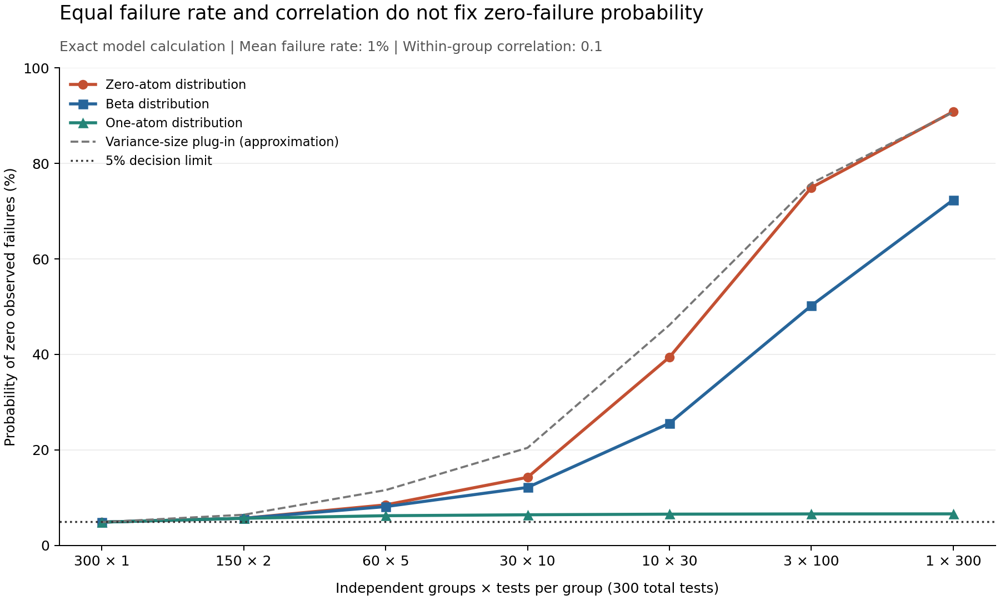

# Zero observed failures: equal correlation can hide different test risks

**Date:** October 9, 2026  
**Version:** 1.0  
**Study type:** Exact mathematical sensitivity study. No AI model was tested.  
**Review status:** Codex generated this study and report. No human or external peer review is claimed.

## Abstract

A safety test can show no failures even when the tested population has a nonzero failure rate. Repeated tests of one case can share an unobserved cause. This study compares three probability distributions with the same mean failure rate and pairwise correlation. It calculates the chance of zero failures under a fixed budget of 300 tests. At a mean rate of 1% and correlation of 0.1, ten groups with 30 tests each give zero-failure probabilities from 6.57% to 39.43%. One group with 300 tests gives probabilities from 6.63% to 90.83%. A common variance-based effective sample size is identical across these distributions, but their zero-failure probabilities differ. The study also gives a case where that sample-size substitution understates the probability of zero failures. These are exact results for specified models. They do not estimate the safety of a deployed AI system.

## 1. Research question and safety relevance

**Question:** With 300 planned binary safety tests, how much can zero-failure evidence change between populations with equal mean failure rate and within-group correlation?

A binary test has two outcomes: failure or no failure. A group can represent repeated tests of one randomly selected task. The group has a fixed but unobserved failure probability. Different groups are independent draws from a defined task population.

Correlation measures how strongly two outcomes in the same group vary together. A positive correlation means that failure outcomes tend to occur together. Conditional independence means that outcomes are independent once the group's failure probability is fixed.

An evaluator might use a test rule that declares evidence for a failure rate below 1% when all 300 tests have no failures. For 300 independent outcomes, the chance of this declaration at a true rate of 1% is 4.90%. We ask how group structure and the assumed probability distribution change this chance.

This question concerns evidence for a defined binary event. It does not measure harm severity, deployment risk, or whether a system is safe for a specific use.

## 2. Related work and contribution

Feng et al. [1] model variation in per-query failure probabilities with a Beta distribution. They derive repeat-attempt probabilities and study estimation across query and repeat budgets. Biroli [2] gives a related zero-event expectation and a fixed-cost allocation analysis. Thus, the Beta calculation and the general benefit of wider independent coverage are prior work.

Gan et al. [3] study how groups of related agent trajectories can invalidate an independence-based evaluation certificate. Their task-level method and empirical results address a different decision process. We do not reproduce or validate those results.

The broad fact that equal mean and variance need not fix a count distribution is also established statistical knowledge. Zaigraev and Kaniovski [6] study event bounds using higher-order dependence. This report does not claim a new theorem, probability model, or first warning about correlated tests. NIST [4] provides the binomial interval calculation used as the independent baseline.

The contribution is a reproducible, fixed-budget decision audit. It compares three explicitly matched distributions, publishes the full numerical grid, and checks whether a variance-size substitution controls the zero-failure event. The three 2026 AI papers cited here are preprints in the versions used. The limited [source search](source_search.md) does not prove novelty.

This question differs from the October 8 repository study. That study analysed incident records and missing severity labels. This study uses synthetic probability models to examine evaluation evidence.

## 3. Method and assumptions

### 3.1 Planned design

The [analysis plan](analysis_plan.md) was saved before calculation. Its SHA-256 hash is recorded in [results_summary.json](results_summary.json).

The total test budget is N=300. Each of G independent groups has m tests, so Gm=N. We use m in {1, 2, 5, 10, 30, 100, 300}. The mean failure rates are p in {0.001, 0.01, 0.05}. The within-group correlations are rho in {0, 0.01, 0.1, 0.5}. The full design has 252 rows across three models.

We assume a fixed system, perfect binary labels, equal group sizes, representative random group selection, and no dependence between groups. There is no adaptive test selection or stopping. All tests must be retained, including failures. The study does not estimate p or rho from observed data.

### 3.2 Three distributions with equal first and second moments

Let Q be the group's failure probability. Given Q, the m outcomes are independent Bernoulli variables. A Bernoulli variable is one with probability Q and zero otherwise. We require

$$E[Q]=p,\qquad \operatorname{Var}(Q)=\rho p(1-p).$$

For two different outcomes X and Y in one group,

$$\operatorname{Cov}(X,Y)=\operatorname{Var}(Q),\qquad \operatorname{Corr}(X,Y)=\rho.$$

The models below meet both conditions. An **atom** is a nonzero probability assigned to one exact value of Q.

| Model | Distribution of Q |
| --- | --- |
| Beta | A continuous distribution on (0,1), with a=pc and b=(1-p)c, where c=1/rho-1 |
| Zero-atom | Q=0 or h=p+rho(1-p); the probability of h is p/h |
| One-atom | Q=l=p(1-rho) or 1; the probability of 1 is (p-l)/(1-l) |

For rho=0, all models reduce to Q=p. The rho=1 limit is a distribution on {0,1} with probability p at 1. The [derivations](derivations.md) check the moments and limits. The atoms are deliberate stress cases. Their realism is not established. We do not claim that these examples are the minimum and maximum over all allowed distributions.

### 3.3 Exact zero-failure probability

For one group, the chance of zero failures is s=E[(1-Q)^m]. For the complete evaluation it is P0=s^G.

For the three models:

$$s_{\rm Beta}=\prod_{j=0}^{m-1}\frac{b+j}{a+b+j},$$

$$s_{\rm zero}=1-\frac{p}{h}\left[1-(1-h)^m\right],$$

$$s_{\rm one}=(1-p)[1-p(1-\rho)]^{m-1}.$$

At m=1, every model gives s=1-p. At m=2, every model gives s=(1-p)^2+rho p(1-p). For m>=3, higher moments can affect s. A higher moment is an expectation such as E[Q^3]. Equal first and second moments do not fix these values.

### 3.4 Decision rule and comparison boundaries

The hypothetical rule declares evidence for p<p0 only when all 300 tests have no failures. Set p0=0.01 and alpha=0.05. Here alpha is the intended upper limit on an incorrect declaration when p>=p0.

Within each specified model at fixed rho, P0 decreases as p increases. Thus P0 at p0 is the largest false-declaration probability over p>=p0 in that model. A value above 0.05 shows that the rule does not meet the intended limit. Proofs appear in [derivations.md](derivations.md).

We also solve P0(p)=0.05 for each model, rho, and allocation. These 84 boundaries apply only to the specified model with known rho. They are not fitted confidence intervals from AI observations. A 5% error limit is not a 95% probability that a particular system is safe.

For independent outcomes, the zero-failure upper boundary is 1-alpha^(1/N). At N=300 it is 0.9936%. This is the one-sided form of the standard binomial calculation. [4]

### 3.5 Variance-based comparison

The sample mean has variance p(1-p)[1+(m-1)rho]/N. Its **variance effective sample size** is therefore

$$N_{\rm eff}=\frac{N}{1+(m-1)\rho}.$$

This number matches the variance of the mean to an independent sample. It is identical across our three models. We compare the exact P0 with the substitution (1-p)^N_eff. Matching a variance does not make this substitution an exact probability or a valid bound. We use it as a comparison. We do not claim that the cited AI papers use or endorse this exact rule.

## 4. Results

### 4.1 Same mean and correlation, different chance of zero failures

The table uses p=1% and rho=0.1. Every row has 300 tests. Values are probabilities of zero observed failures, expressed as percentages.

| Independent groups | Tests per group | One-atom | Beta | Zero-atom |
| ---: | ---: | ---: | ---: | ---: |
| 300 | 1 | 4.90% | 4.90% | 4.90% |
| 150 | 2 | 5.71% | 5.71% | 5.71% |
| 60 | 5 | 6.25% | 8.15% | 8.51% |
| 30 | 10 | 6.44% | 12.17% | 14.28% |
| 10 | 30 | 6.57% | 25.60% | 39.43% |
| 3 | 100 | 6.62% | 50.22% | 74.93% |
| 1 | 300 | 6.63% | 72.35% | 90.83% |

Only the first allocation meets the 5% limit in this table. With two tests per group, all models still agree, but they already exceed that limit. With 30 tests per group, the largest probability is about six times the smallest. With 300 tests per group, it is about 13.7 times the smallest.

*Figure 1. Exact model probabilities. The x-axis lists distinct test allocations. Lines connect the listed values. The dashed variance-size substitution is an approximation, not a bound.*

### 4.2 Conditional boundaries differ

For ten groups with 30 tests each and rho=0.1, the p values that give P0=0.05 are:

| Assumed model | Failure-rate boundary |
| --- | ---: |
| One-atom | 1.100% |
| Beta | 2.191% |
| Zero-atom | 3.441% |

The independent-outcome boundary is 0.9936%. These values show sensitivity to the full assumed distribution even when rho is held fixed. Selecting the smallest boundary after seeing the results would not be a valid safety argument.

### 4.3 The variance-size substitution is not always conservative

The full planned grid includes nine rows where the substitution is below the exact probability by more than 10^-12. All nine use the zero-atom model. The largest absolute gap is a stress case selected after inspecting the grid: p=5%, rho=0.01, and one group with 300 tests.

In this case, N_eff=75.188. The substitution gives a zero-failure probability of **2.11%**. The exact zero-atom probability is **15.97%**. Thus, at a 5% target failure rate, that substitution would place the zero-failure rule below the 5% error limit while the exact model places it above. This is a counterexample to a universal conservative-bound claim for the substitution. It is not a claim that the approximation always understates risk.

This stress case uses one independent group. It is a permitted mathematical counterexample, not an estimate of a common evaluation design. The full [grid](results_grid.csv) shows the other allocations and models.

### 4.4 Controls and numerical uncertainty

The calculations confirm equal results at m=1, equal results at m=2, the independent limit at rho=0, and the fully dependent limit at rho=1. The numerical monotonicity checks cover 84,000 steps. All 84 boundary residuals are below 10^-12 in the main calculation.

No Monte Carlo sample was used. There is no sampling error bar or random seed. Exact here means a closed-form model calculation evaluated numerically; it does not mean exact knowledge of an AI system. The separate validation and review records state the numerical checks and their limits.

## 5. Discussion

Mean failure rate and pairwise correlation are not enough to specify a zero-failure claim. Their use in a variance calculation does not determine the probability of observing no events. The shape of the group failure distribution also matters.

For a proposed zero-failure decision, report the number of independent groups, the repeat count, and the assumptions about group selection. A Beta model is an assumption to check, not a consequence of knowing a mean and correlation. The study gives transparent examples for this check.

More groups help detect at least one failure under this equal-cost, independent-group model. This result does not show that repetitions have no value. Repetitions can help estimate within-task variation, judge consistency, or the risk from repeated attempts. These are different objectives. New groups can also cost more or remain dependent. The present calculation does not optimize those settings.

## 6. Limitations

All grid parameters are synthetic and were selected before analysis. No estimate links the chosen p or rho to a deployed model. The atom models place some groups at exactly zero or one failure probability. A practical population may have a different shape.

The results depend on independence between groups, stable probabilities, perfect labels, and equal group sizes. Correlation due to service state, shared conversations, adaptive prompts, or model changes is outside the model. In practice, rho must be estimated with uncertainty. We treat it as known.

No human subjects, AI responses, training data, or model benchmarks are used. Thus, benchmark leakage is not part of this study. Selection of a model after looking at real evaluation outcomes would create a separate inference problem. This report does not address it.

The grid is finite. The reported examples do not give worst-case bounds over every distribution with the same moments. We do not test real false-clearance rates, predict incidents, compare AI products, or certify a system.

## 7. Ethics, misuse, and AI use

This study can help detect unsupported safety claims. Its calculations could also be misused to present a favourable assumption as established fact. To reduce that risk, the report states all assumptions and publishes the full grid. It contains no harmful prompts, attack instructions, private data, or secrets.

Codex selected the question, wrote the calculations and report, and generated the figure. Separate Codex agents reviewed sources, mathematical claims, and numerical results. Agent review is not human review. No human or external peer review occurred. The user is not represented as an author or reviewer.

The work used local computation and public research pages. No paid model call or new compute service was used. The repository has no general reuse license. This study does not assign one. Referenced papers retain their own rights; their datasets, source text, and code are not redistributed here.

## 8. Reproduction and review

The [README](README.md) gives the commands. The calculation and validation use Python's standard library. The optional figure uses the saved plot dependencies. The [analysis plan](analysis_plan.md), [derivations](derivations.md), [raw grid](results_grid.csv), [boundary results](results_boundaries.csv), [run log](run_log.txt), and [review](review.md) support the report.

The review uses relevant parts of the NeurIPS Paper Checklist [5]. This use does not establish NeurIPS approval, peer review, or submission compliance.

## References

1. Feng, M., et al. (2026). *Statistical Estimation of Adversarial Risk in Large Language Models under Best-of-N Sampling*. arXiv:2601.22636v2. [Preprint and model definitions](https://arxiv.org/html/2601.22636v2).
2. Biroli, M. (2026). *Escaping Alignment: A Physical Trap Model of Best-of-N Jailbreaking*. arXiv:2609.32116v1. [Preprint, especially Appendix B](https://arxiv.org/html/2609.32116v1).
3. Gan, C., et al. (2026). *Certified Selective Automation of LLM Agent Evaluation*. arXiv:2609.34320v1. [Preprint](https://arxiv.org/html/2609.34320v1).
4. NIST/SEMATECH. *e-Handbook of Statistical Methods*, Section 7.2.4.1, Confidence intervals. [Exact binomial interval method](https://www.itl.nist.gov/div898/handbook/prc/section2/prc241.htm). Accessed October 9, 2026. The page gives the two-sided tail equations; this report uses a one-sided tail of 0.05 and derives the zero-failure form.
5. NeurIPS. *Paper Checklist Guidelines*. [Review aid](https://neurips.cc/public/guides/PaperChecklist). Accessed October 9, 2026.

6. Zaigraev, A., and Kaniovski, S. (2010). *Exact bounds on the probability of at least k successes in n exchangeable Bernoulli trials as a function of correlation coefficients*. Statistics & Probability Letters, 80(13–14), 1079–1084. [Author manuscript](https://serguei.kaniovski.wifo.ac.at/fileadmin/pdf/kn_reliability.pdf). DOI: 10.1016/j.spl.2010.02.023.
